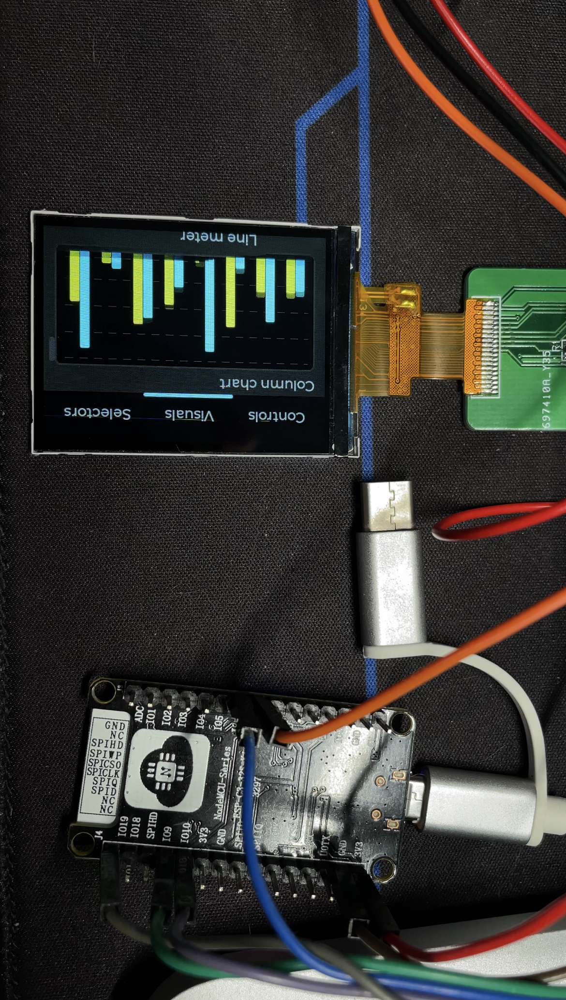

# LVGL project for ESP32

# ESP32-C3 LVGL移植

[LVGL文档](https://docs.lvgl.io/latest/en/html/get-started/espressif.html)

[Github仓库](https://github.com/lvgl/lv_port_esp32)

**截止到2021-9-19（中秋放假第一天）LVGL官方并不支持ESP-C3型号**(什么时候可以买到ESP32-H2啊)

本次着重介绍如何修改为支持ESP32-C3:

- 2寸LCD屏幕，分辨率240*320，驱动为ST7789
- 所需要VSCode ESP-IDF 版本4.3
- LVGL版本7.9



### 下载并打开项目

1. 克隆项目

~~~bash
git clone --recurse-submodules https://github.com/lvgl/lv_port_esp32.git
~~~

2. 使用VSCode导入项目


3. 快捷键command+shift+P设置目标芯片为ESP32-C3


### 修改配置

1. 打开配置工具(下方菜单栏中的齿轮⚙️)  
2. 设置分辨率  


3. 根据情况选择TFT屏幕驱动型号，示例采用的是ST7789


4. 配置引脚，详情如下面表格


| ESP32    | LCD  | 说明                                        |
| -------- | ---- | ------------------------------------------- |
| REST     | 18   | 上电后必须进行复位                          |
| SPI_CS   | 10   | 当片选信号为"L"时，数据/指令 I/O 口使能。   |
| SPI_CLK  | 6    | SPI时钟                                     |
| SPI_DC   | 9    | 指令/数据 选择端口:“H” : 数据 ;“L” : 指令。 |
| SPI_MOSI | 7    | 主机输出从机输入                            |

5. **不要忘记保存配置**

### 修改ESP32-C3所需要的文件

修改配置文件后，编译会出现以下错误，根据错误进行修改。(**错误信息忘记保存了**)

1. 修改HSPI_HOST，在lvgl_spi_config.h大约67行上下：

~~~c
#if defined (CONFIG_LV_TFT_DISPLAY_SPI_HSPI)
    #if CONFIG_IDF_TARGET_ESP32C3
        #define TFT_SPI_HOST SPI2_HOST
    #else
        #define TFT_SPI_HOST HSPI_HOST
    #endif
#elif defined (CONFIG_LV_TFT_DISPLAY_SPI_VSPI)
#define TFT_SPI_HOST VSPI_HOST
#elif defined (CONFIG_LV_TFT_DISPLAY_SPI_FSPI)
#define TFT_SPI_HOST FSPI_HOST
#endif
~~~

说明：如果判断芯片目标为C3，将使用SPI2_HOST。

2. 在lvgl_helpers.c中207行左右：

~~~c
#if defined (CONFIG_IDF_TARGET_ESP32)
    assert((SPI_HOST <= host) && (VSPI_HOST >= host));
    const char *spi_names[] = {
        "SPI_HOST", "HSPI_HOST", "VSPI_HOST"
    };
#elif defined (CONFIG_IDF_TARGET_ESP32S2)
    assert((SPI_HOST <= host) && (HSPI_HOST >= host));
    const char *spi_names[] = {
        "SPI_HOST", "", ""
    };
#elif defined (CONFIG_IDF_TARGET_ESP32C3)
    // assert((SPI_HOST <= host) && (HSPI_HOST >= host));
    const char *spi_names[] = {
        "SPI2_HOST", "", ""
    };
#endif
~~~

说明：如果判断芯片目标为C3，添加SPI2_HOST

3. 在lvgl_helpers.c中111行左右：

~~~c
//改为2 SPI_DMA_CH_AUTO
lvgl_spi_driver_init(TFT_SPI_HOST,
        DISP_SPI_MISO, DISP_SPI_MOSI, DISP_SPI_CLK,
        SPI_BUS_MAX_TRANSFER_SZ, SPI_DMA_CH_AUTO,
        DISP_SPI_IO2, DISP_SPI_IO3);
~~~

说明：C3只能使用自动DMA分配

4. 在ST7789.c 91行-100号：

~~~c
//取消引脚内部调用
//将gpio_pad_select_gpio改为gpio_reset_pin

    //Initialize non-SPI GPIOs
    gpio_reset_pin(ST7789_DC);
    gpio_set_direction(ST7789_DC, GPIO_MODE_OUTPUT);

#if !defined(CONFIG_LV_DISP_ST7789_SOFT_RESET)
    gpio_reset_pin(ST7789_RST);
    gpio_set_direction(ST7789_RST, GPIO_MODE_OUTPUT);
#endif

#if ST7789_ENABLE_BACKLIGHT_CONTROL
    gpio_reset_pin(ST7789_BCKL);
    gpio_set_direction(ST7789_BCKL, GPIO_MODE_OUTPUT);
#endif
~~~

说明：示例用REST引脚为18，18引脚被用作USB-，需要取消内部调用，也可以参考下面函数：

~~~c
#if CONFIG_IDF_TARGET_ESP32C3
#include "hal/gpio_ll.h"
#endif
	
#if CONFIG_IDF_TARGET_ESP32C3
		if (GPIO_BL == 18 || GPIO_BL== 19) {
			CLEAR_PERI_REG_MASK(USB_DEVICE_CONF0_REG, USB_DEVICE_USB_PAD_ENABLE);
		}
    	#endif
~~~

5. 完成以上四个步骤，烧写程序效果如果：


This is an ESP32 demo project showcasing LVGL v7 with support for several display controllers and touch controllers.
The demo application is the `lv_demo_widgets` project from the [lv_examples](https://github.com/lvgl/lv_examples) repository.

- Version of ESP-IDF required 4.2. NOTE: We're trying to make this repo backwards compatible, usage of idf.py is encouraged.
- Version of LVGL used: 7.9.
- Version of lv_examples used: 7.9.

#### Table of content
- [LVGL project for ESP32](#lvgl-project-for-esp32)
- [ESP32-C3 LVGL移植](#esp32-c3-lvgl移植)
    - [下载并打开项目](#下载并打开项目)
    - [修改配置](#修改配置)
    - [修改ESP32-C3所需要的文件](#修改esp32-c3所需要的文件)
      - [Table of content](#table-of-content)
  - [Display and touch controllers](#display-and-touch-controllers)
  - [Get started](#get-started)
    - [Prerequisites](#prerequisites)
    - [Note](#note)
    - [Build and run the demo.](#build-and-run-the-demo)
  - [Use LVGL in your ESP-IDF project](#use-lvgl-in-your-esp-idf-project)
  - [Use lvgl_esp32_drivers in your project](#use-lvgl_esp32_drivers-in-your-project)
  - [Platformio support](#platformio-support)
- [ESP32-S2 Support](#esp32-s2-support)
  - [Background](#background)
- [ESP32-C3 LVGL移植](#esp32-c3-lvgl移植-1)

Example demo for TFT displays:


Monochrome support:


## Display and touch controllers

The display and touch (indev) controllers are now into it's own repository, you can find it [here](https://github.com/lvgl/lvgl_esp32_drivers).
To report any issue or add new display or touch (indev) drivers you can do so in the `lvgl_esp32_drivers` repo.

## Get started

### Prerequisites

- ESP-IDF Framework.

### Note

This project tries to be compatible with both the ESP-IDF v3.x and v4.0, but using v4.0 is recommended.
Instructions assume you are using the v4.x toolchain, otherwise use the make commands, e.g. instead of running `idf.py menuconfig`, run `make menuconfig`.

### Build and run the demo.

1. Clone this project by `git clone --recurse-submodules https://github.com/lvgl/lv_port_esp32.git`, this will pull this repo and its submodules.

2. Get into the created `lv_port_esp32` directory.

3. Run `idf.py menuconfig`

4. Configure LVGL in `Components config->LVGL Configuration`. For monochrome displays use the mono theme and we suggest enabling the `unscii 8` font.

5. Configure your display and/or touch controllers in `Components config->LVGL TFT Display Configuration` and `Components config->LVGL TOUCH Configuration`.

6. Store your project configuration.

7. Build the project with `idf.py build`

8. If the build don't throw any errors, flash the demo with `idf.py -p (YOUR SERIAL PORT) flash` (with `make` this is just `make flash` - in 3.x PORT is configured in `menuconfig`)

## Use LVGL in your ESP-IDF project

LVGL now includes a Kconfig file which is used to configure most of the LVGL configuration options via menuconfig, so it's not necessary to use a custom `lv_conf.h` file.

It is recommended to add LVGL as a submodule in your IDF project's git repo.

From your project's root directory:
1. Create a directory named `components` (if you don't have one already) with `mkdir -p components`.
2. Clone the lvgl repository inside the `components` directory with `git submodule add https://github.com/lvgl/lvgl.git components/lvgl`
3. Run `idf.py menuconfig`, go to `Component config` then `LVGL configuration` to configure LVGL.

## Use lvgl_esp32_drivers in your project

It is recommended to add [lvgl_esp32_drivers](https://github.com/lvgl/lvgl_esp32_drivers) as a submodule in your IDF project's git repo.

From your project's root directory:
1. Create a directory named `components` (if you don't have one already) with `mkdir -p components`.
2. Clone the lvgl_esp32_drivers repository inside the `components` directory with `git submodule add https://github.com/lvgl/lvgl_esp32_drivers.git components/lvgl_esp32_drivers`
3. Run `idf.py menuconfig`, go to `Component config` then `LVGL TFT configuration` and `LVGL TFT Display configuration` to configure lvgl_esp32_drivers.

## Platformio support

Using the [lv_platformio](https://github.com/lvgl/lv_platformio) project add the following lines to `platformio.ini` file:

```
[env:esp32]
platform = espressif32
framework = espidf
board = esp-wrover-kit
```

Change the default environment to `default_envs = esp32`.

Modify the `main.c` like this:

```c
#include "lvgl.h"

// #include "driver.h"

#include "demo.h"

int app_main(void)
{
    lv_init();

    /* Initialize your hardware. */
    
    /* hw_init(); */

    demo_create();

    /* Create the UI or start a task for it.
     * In the end, don't forget to call `lv_task_handler` in a loop. */

    /* hw_loop(); */

    return 0;
}
```

For more information see: [platformio with espidf framework compability](https://github.com/lvgl/lv_port_esp32/issues/168).

# ESP32-S2 Support

Support for ESP32-S2 variant is Work In Progress.
Smaller displays (e.g. 320x240) work fine, but larger ones need testing.

## Background

ESP32-S2 has less on-chip SRAM than its predecessor ESP32 (520kB vs. 320kB).
This causes problems with memory allocation with large LVGL display buffers as they don't fit into the on-chip memory
and external PSRAM is not accessible by DMA.

Moreover, static allocation to external PSRAM is not yet supported
(see [GitHub issue](https://github.com/espressif/esp-idf/issues/6162)).

At this momement, the buffers are dynamicaly allocated with DMA capabilty and memory allocator handles the rest.

# ESP32-C3 LVGL移植

[LVGL文档](https://docs.lvgl.io/latest/en/html/get-started/espressif.html)

[Github仓库](https://github.com/lvgl/lv_port_esp32)

