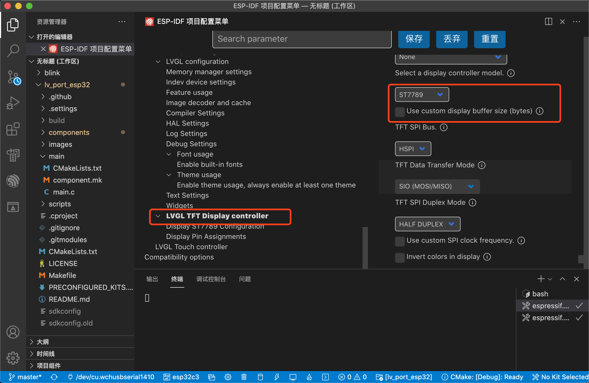
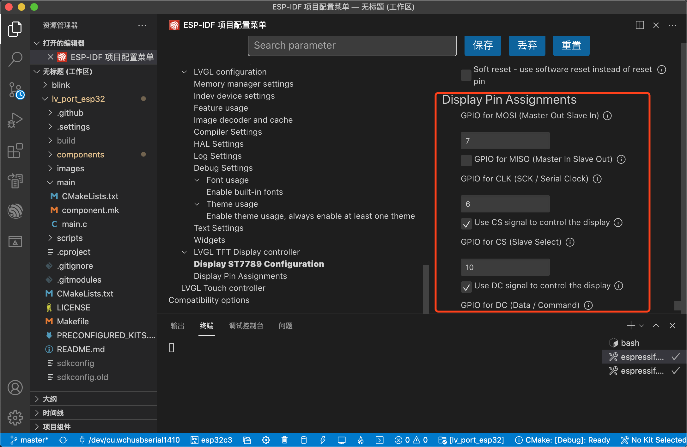

# Display and touchpad drivers for ESP32 using LVGL

For a ready to use ESP32 project take look at the [lv_port_esp32](https://github.com/lvgl/lv_port_esp32) repository.

#### Table of content
- [Display and touchpad drivers for ESP32 using LVGL](#display-and-touchpad-drivers-for-esp32-using-lvgl)
      - [Table of content](#table-of-content)
  - [Supported display controllers](#supported-display-controllers)
  - [Supported indev controllers](#supported-indev-controllers)
  - [Support for predefined development kits](#support-for-predefined-development-kits)
- [ESP32-C3 LVGL移植](#esp32-c3-lvgl移植)
    - [下载并打开项目](#下载并打开项目)
    - [修改配置](#修改配置)
    - [修改ESP32-C3所需要的文件](#修改esp32-c3所需要的文件)

**NOTE:** You need to set the display horizontal and vertical size, color depth and
swap of RGB565 color on the LVGL configuration menuconfig (it's not handled automatically).

## Supported display controllers

| Display Controller                          | Type       | Interface              | Color depth (LV_COLOR_DEPTH) | Swap RGB565 color (LV_COLOR_16_SWAP)   |
|---------------------------------------------|------------|------------------------|------------------------------|----------------------------------------|
| ILI9341                                     | TFT        | SPI                    | 16: RGB565                   | Yes                                    |
| ILI9486                                     | TFT        | SPI                    | 16: RGB565                   | Yes                                    |
| ILI9488                                     | TFT        | SPI                    | 16: RGB565                   | No                                     |
| HX8357B/HX8357D                             | TFT        | SPI                    | 16: RGB565                   | Yes                                    |
| ST7789                                      | TFT        | SPI                    | 16: RGB565                   | Yes                                    |
| ST7735S                                     | TFT        | SPI                    | 16: RGB565                   | Yes                                    |
| FT81x                                       | TFT        | Single, Dual, Quad SPI | 16: RGB565                   | No                                     |
| GC9A01                                      | TFT        | SPI                    | 16: RGB565                   | Yes                                    |
| RA8875                                      | TFT        | SPI                    | 16: RGB565                   | Yes                                    |
| SH1107                                      | Monochrome | SPI                    | 1: 1byte per pixel           | No                                     |
| SSD1306                                     | Monochrome | I2C                    | 1: 1byte per pixel           | No                                     |
| IL3820                                      | e-Paper    | SPI                    | 1: 1byte per pixel           | No                                     |
| UC8151D/ GoodDisplay GDEW0154M10 DES        | e-Paper    | SPI                    | 1: 1byte per pixel           | No                                     |
| FitiPower JD79653A/ GoodDisplay GDEW0154M09 | e-Paper    | SPI                    | 1: 1byte per pixel           | No                                     |

## Supported indev controllers

- XPT2046
- FT3236
- other FT6X36 or the FT6206 controllers should work as well (not tested)
- STMPE610
- FT81x (Single, Dual, and Quad SPI)

If your display or input device (touch) controller is not supported consider contributing to this repo by
adding support to it! [Contribute controller support](CONTRIBUTE_CONTROLLER_SUPPORT.md)

## Support for predefined development kits

You can also use the predefined kits, which selects the correct display controllers on the kit,
and sets the gpio numbers for the interface.

| Kit name                  | Display controller    | Interface | Hor. Res. | Ver. Res. |
|---------------------------|-----------------------|-----------|-----------|-----------|
| ESP Wrover Kit v4.1       | ILI9341               | SPI       | 240       | 320       |
| M5Stack                   | ILI9341               | SPI       | 240       | 320       |
| M5Stick                   | SH1107                | SPI       | -         | -         |
| M5StickC                  | ST7735S               | SPI       | 80        | 160       |
| Adafruit 3.5 Featherwing  | HX8357                | SPI       | 480       | 320       |
| RPi MPI3501               | ILI9486               | SPI       | -         | -         |
| Wemos Lolin OLED          | SSD1306               | SPI       | 64        | 128       |
| ER-TFT035-6               | ILI9488               | SPI       | 480       | 320       |
| AIRcable ATAGv3           | IL3820                | SPI       | 128       | 296       |
| TTGO T-Display            | ST7789                | SPI       | 135       | 240       |
| TTGO Camera Plus          | ST7789                | SPI       | 240       | 240       |

**NOTE:** See [Supported display controllers](#supported-display-controllers) for more information on display configuration.
**NOTE:** See [Supported indev controllers](#supported-indev-controllers) for more information about indev configuration.

# ESP32-C3 LVGL移植

[LVGL文档](https://docs.lvgl.io/latest/en/html/get-started/espressif.html)

[Github仓库](https://github.com/lvgl/lv_port_esp32)

**截止到2021-9-19（中秋放假第一天）LVGL官方并不支持ESP-C3型号**(什么时候可以买到ESP32-H2啊)

本次着重介绍如何修改为支持ESP32-C3:

- 2寸LCD屏幕，分辨率240*320，驱动为ST7789
- 所需要VSCode ESP-IDF 版本4.3
- LVGL版本7.9

### 下载并打开项目

1. 克隆项目

~~~bash
git clone --recurse-submodules https://github.com/lvgl/lv_port_esp32.git
~~~

2. 使用VSCode导入项目

3. 快捷键command+shift+P设置目标芯片为ESP32-C3

### 修改配置

1. 打开配置工具(下方菜单栏中的齿轮⚙️)  
2. 设置分辨率  

1. 根据情况选择TFT屏幕驱动型号，示例采用的是ST7789

4. 配置引脚，详情如下面表格

| ESP32    | LCD  | 说明                                        |
| -------- | ---- | ------------------------------------------- |
| REST     | 18   | 上电后必须进行复位                          |
| SPI_CS   | 10   | 当片选信号为"L"时，数据/指令 I/O 口使能。   |
| SPI_CLK  | 6    | SPI时钟                                     |
| SPI_DC   | 9    | 指令/数据 选择端口:“H” : 数据 ;“L” : 指令。 |
| SPI_MOSI | 7    | 主机输出从机输入                            |

5. **不要忘记保存配置**

### 修改ESP32-C3所需要的文件

修改配置文件后，编译会出现以下错误，根据错误进行修改。(**错误信息忘记保存了**)

1. 修改HSPI_HOST，在lvgl_spi_config.h大约67行上下：

~~~c
#if defined (CONFIG_LV_TFT_DISPLAY_SPI_HSPI)
    #if CONFIG_IDF_TARGET_ESP32C3
        #define TFT_SPI_HOST SPI2_HOST
    #else
        #define TFT_SPI_HOST HSPI_HOST
    #endif
#elif defined (CONFIG_LV_TFT_DISPLAY_SPI_VSPI)
#define TFT_SPI_HOST VSPI_HOST
#elif defined (CONFIG_LV_TFT_DISPLAY_SPI_FSPI)
#define TFT_SPI_HOST FSPI_HOST
#endif
~~~

说明：如果判断芯片目标为C3，将使用SPI2_HOST。

2. 在lvgl_helpers.c中207行左右：

~~~c
#if defined (CONFIG_IDF_TARGET_ESP32)
    assert((SPI_HOST <= host) && (VSPI_HOST >= host));
    const char *spi_names[] = {
        "SPI_HOST", "HSPI_HOST", "VSPI_HOST"
    };
#elif defined (CONFIG_IDF_TARGET_ESP32S2)
    assert((SPI_HOST <= host) && (HSPI_HOST >= host));
    const char *spi_names[] = {
        "SPI_HOST", "", ""
    };
#elif defined (CONFIG_IDF_TARGET_ESP32C3)
    // assert((SPI_HOST <= host) && (HSPI_HOST >= host));
    const char *spi_names[] = {
        "SPI2_HOST", "", ""
    };
#endif
~~~

说明：如果判断芯片目标为C3，添加SPI2_HOST

3. 在lvgl_helpers.c中111行左右：

~~~c
//改为2 SPI_DMA_CH_AUTO
lvgl_spi_driver_init(TFT_SPI_HOST,
        DISP_SPI_MISO, DISP_SPI_MOSI, DISP_SPI_CLK,
        SPI_BUS_MAX_TRANSFER_SZ, SPI_DMA_CH_AUTO,
        DISP_SPI_IO2, DISP_SPI_IO3);
~~~

说明：C3只能使用自动DMA分配

4. 在ST7789.c 91行-100号：

~~~c
//取消引脚内部调用
//将gpio_pad_select_gpio改为gpio_reset_pin

    //Initialize non-SPI GPIOs
    gpio_reset_pin(ST7789_DC);
    gpio_set_direction(ST7789_DC, GPIO_MODE_OUTPUT);

#if !defined(CONFIG_LV_DISP_ST7789_SOFT_RESET)
    gpio_reset_pin(ST7789_RST);
    gpio_set_direction(ST7789_RST, GPIO_MODE_OUTPUT);
#endif

#if ST7789_ENABLE_BACKLIGHT_CONTROL
    gpio_reset_pin(ST7789_BCKL);
    gpio_set_direction(ST7789_BCKL, GPIO_MODE_OUTPUT);
#endif
~~~

说明：示例用REST引脚为18，18引脚被用作USB-，需要取消内部调用，也可以参考下面函数：

~~~c
#if CONFIG_IDF_TARGET_ESP32C3
#include "hal/gpio_ll.h"
#endif
	
#if CONFIG_IDF_TARGET_ESP32C3
		if (GPIO_BL == 18 || GPIO_BL== 19) {
			CLEAR_PERI_REG_MASK(USB_DEVICE_CONF0_REG, USB_DEVICE_USB_PAD_ENABLE);
		}
    	#endif
~~~

5. 完成以上四个步骤，烧写程序效果如果：

